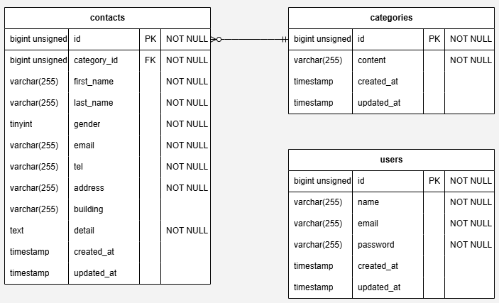

# アプリケーション名
- coachtech お問い合わせフォーム
## 環境構築
### Dockerビルド
- git clone git@github.com:okaja120614-hub/test_contact-form.git
- docker-compose up -d --build
### Laravel環境構築
- docker-compose exec php bash
- composer install
- cp .env.example .env , 環境変数を変更
- php artisan key:generate
- php artisan migrate
- php artisan db:seed
## 開発環境
- お問い合わせ画面:http://localhost/
- ユーザー登録:http://localhost/register
- phpMyAdmin:http://localhost:8080/
## 使用技術(実行環境)
- PHP 8.5.1
- Laravel Framework 8.83.29
- mysql 8.0.26
- nginx 1.21.1
## ER図
